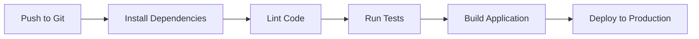

# Recursive Todo App

A todo list application with infinite nested sub-tasks, built with Remix and Appwrite.

## Features

- 🔐 User authentication (signup/login)
- ✅ Create, complete, and delete tasks
- 🔄 **Recursive sub-tasks** - add tasks within tasks infinitely
- 💾 Data persistence with Appwrite
- 🎨 Clean, responsive UI

## Tech Stack

- **Frontend**: Remix, React
- **Backend**: Appwrite (BaaS)
- **Testing**: Vitest, Testing Library
- **Deployment**: [Your choice - Vercel/Netlify/etc]

## Getting Started

### Prerequisites

- Node.js 18+
- Appwrite account (cloud.appwrite.io)

### Installation

1. Clone the repository
```bash
git clone <your-repo-url>
cd recursive-todo-app
```

2. Install dependencies
```bash
npm install
```

3. Set up environment variables

Create a `.env` file:
```env
APPWRITE_ENDPOINT=https://cloud.appwrite.io/v1
APPWRITE_PROJECT_ID=your_project_id
APPWRITE_DATABASE_ID=your_database_id
APPWRITE_TODOS_COLLECTION_ID=your_collection_id
```

4. Set up Appwrite

- Create a project in Appwrite Console
- Create a database and a "todos" collection with these attributes:
  - `userId` (string, required)
  - `title` (string, required)
  - `completed` (boolean, required)
  - `parentId` (string, optional)
- Set collection permissions to allow authenticated users to read/write

5. Run the development server
```bash
npm run dev
```

Visit `http://localhost:3000`

## Running Tests
```bash
# Run tests
npm test

# Run tests with UI
npm run test:ui

# Run tests once (for CI)
npm run test:run
```

## CI/CD Pipeline Plan

### Pipeline Stages


### Detailed Pipeline Steps

#### 1. **Install Dependencies**
- Run `npm ci` (faster and more reliable than `npm install` for CI)
- Cache `node_modules` to speed up subsequent builds

#### 2. **Lint & Format**
- Run ESLint: `npm run lint`
- Check code formatting (if using Prettier)
- Fail pipeline if linting errors exist

#### 3. **Run Tests**
- Execute unit tests: `npm run test:run`
- Generate code coverage report
- Fail pipeline if tests fail or coverage drops below threshold (e.g., 80%)

#### 4. **Build**
- Run production build: `npm run build`
- Verify build artifacts are created
- Check for build warnings/errors

#### 5. **Deploy**
- Deploy to staging environment (on `develop` branch)
- Deploy to production (on `main` branch)
- Run smoke tests post-deployment

### Recommended Tools & Platforms

#### Option 1: GitHub Actions (Recommended)
**Why**: Free for public repos, native GitHub integration, large marketplace
```yaml
# .github/workflows/ci-cd.yml
name: CI/CD Pipeline

on:
  push:
    branches: [main, develop]
  pull_request:
    branches: [main]

jobs:
  test:
    runs-on: ubuntu-latest
    steps:
      - uses: actions/checkout@v3
      - uses: actions/setup-node@v3
        with:
          node-version: '18'
          cache: 'npm'
      
      - name: Install dependencies
        run: npm ci
      
      - name: Lint
        run: npm run lint
      
      - name: Run tests
        run: npm run test:run
      
      - name: Build
        run: npm run build

  deploy:
    needs: test
    runs-on: ubuntu-latest
    if: github.ref == 'refs/heads/main'
    steps:
      - uses: actions/checkout@v3
      - name: Deploy to Vercel
        run: vercel --prod --token=${{ secrets.VERCEL_TOKEN }}
```

#### Option 2: GitLab CI
**Why**: Built-in CI/CD, great for private repos, powerful features
```yaml
# .gitlab-ci.yml
stages:
  - install
  - test
  - build
  - deploy

install:
  stage: install
  script:
    - npm ci
  cache:
    paths:
      - node_modules/

test:
  stage: test
  script:
    - npm run lint
    - npm run test:run
  coverage: '/Lines\s*:\s*(\d+\.\d+)%/'

build:
  stage: build
  script:
    - npm run build
  artifacts:
    paths:
      - build/

deploy:
  stage: deploy
  script:
    - npm run deploy
  only:
    - main
```

#### Option 3: Vercel (Simplest)
**Why**: Zero-config deployment for Remix apps

- Connect GitHub repo to Vercel
- Auto-deploys on push to main
- Preview deployments for PRs
- Built-in environment variable management

### Environment Variables in CI/CD

Securely store these as secrets:
- `APPWRITE_ENDPOINT`
- `APPWRITE_PROJECT_ID`
- `APPWRITE_DATABASE_ID`
- `APPWRITE_TODOS_COLLECTION_ID`

### Monitoring & Alerts

- Set up Sentry or similar for error tracking
- Configure deployment notifications (Slack/Discord)
- Monitor performance metrics
- Set up uptime monitoring (e.g., Uptime Robot)

### Deployment Strategy

**Blue-Green Deployment**:
1. Deploy new version to "green" environment
2. Run health checks
3. Switch traffic from "blue" to "green"
4. Keep "blue" as rollback option

## Project Structure
```
app/
├── routes/
│   ├── _index.tsx        # Login page
│   ├── signup.tsx        # Signup page
│   ├── todos.tsx         # Main todo page
│   └── logout.tsx        # Logout handler
├── components/
│   ├── TodoList.tsx      # Todo list components
│   └── __tests__/        # Component tests
├── lib/
│   ├── appwrite.server.ts    # Server-side Appwrite client
│   ├── appwrite.client.ts    # Client-side Appwrite client
│   └── appwrite-auth.server.ts  # Auth helpers
└── utils/
    └── todoTree.ts       # Recursive tree builder

## License

MIT
```

Run the tests:
```bash
npm test
```

